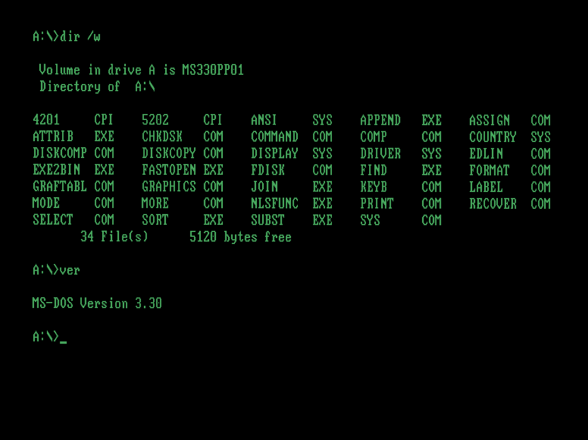

# Clock Signal

Clock Signal ('CLK') is an emulator that seeks to be invisible. Users directly launch classic software, avoiding the learning curves associated with emulators and with classic machines.

macOS and source releases are [hosted on GitHub](https://github.com/TomHarte/CLK/releases). A Qt-based Linux build is available as a [Snap](https://snapcraft.io/clock-signal). 

This emulator seeks to offer:

* single-click load of any piece of source media for any supported platform;
* with a heavy signal processing tilt for accurate reproduction of original outputs;
* avoiding latency as much as possible.

It currently contains emulations of the:

* Acorn Electron;
* Amstrad CPC;
* Apple II/II+ and IIe;
* Atari 2600;
* Atari ST;
* ColecoVision;
* Commodore Vic-20 (and Commodore 1540/1);
* Enterprise 64/128;
* Macintosh 128K, 512K, 512Ke, and Plus;
* MSX 1 and 2;
* Oric 1/Atmos;
* Sega Master System;
* Sinclair ZX80/81; and
* Sinclair ZX Spectrum.

Also present but very much upcoming are the:

* Acorn Archimedes;
* Commodore Amiga; and
* early PC compatible.

On the Mac it is a native Cocoa and Metal application; under Linux, BSD and other UNIXes and UNIX-alikes it uses OpenGL and can be built either with Qt or with SDL.

## Single-step Loading

Through static and runtime analysis CLK seeks automatically to select and configure the appropriate machine to run any provided disk, tape or ROM; to issue any commands necessary to run the software contained on the disk, tape or ROM; and to provide accelerated loading where feasible.

With CLK installed the full process of loading a piece of software — even if you've never used the machine it runs on before — is:

1. locate it in your OS;
2. double click it.

There's no need to wade through creating a new machine, inserting media into it or figuring out which loading command goes with this piece of software, and no import procedure — CLK does not attempt to take ownership of your files or to usurp your OS.

Keep your emulated titles on your desktop, in your dock, or wherever else you usually prefer to launch software from, and launch in a single step. Just like any other piece of desktop software.

## Signal Processing

Consider an ordinary, unmodified Commodore Vic-20. Its only video output is composite. Therefore the emulated machine's only video output is composite. In order to display the video output, your GPU must decode composite video. Therefore composite video artefacts are present and correct — not because of a post hoc filter but because the real signal is really being processed.

Similar effort is put into audio generation. If the real machine normally generates audio at 192Khz then the emulator generates a 192Khz source signal and filters it down to whatever the host machine can output.

### Samples

<table>
	<tbody>
	<tr>
		<th>1:1 Pixel Copying</th>
		<th>Composite Decoded</th>
	</tr><tr>
		<td width=50%></td>
		<td width=50%></td>
	</tr><tr>
		<td width=50%></td>
		<td width=50%></td>
	</tr><tr>
		<td width=50%></td>
		<td width=50%></td>
	</tr><tr>
		<td width=50%></td>
		<td width=50%></td>
	</tr><tr>
		<td width=50%></td>
		<td width=50%></td>
	</tr><tr>
		<td width=50%></td>
		<td width=50%></td>
	</tr>
	</tbody>
</table>

<table>
	<tbody>
	<tr>
		<th>1:1 Pixel Copying</th>
		<th>Correct Aspect Ratio, Filtered</th>
	</tr><tr>
		<td width=50%></td>
		<td width=50%></td>
	</tr><tr>
		<td width=50%></td>
		<td width=50%></td>
	</tr>
	</tbody>
</table>

## Low Latency

The display produced is an emulated CRT, with phosphor decay. Therefore if you have a 140Hz 4k monitor it can produce 140 distinct frames per second at 4k resolution. Latency is dictated by the host hardware, not the emulated machine or emulator.

Audio latency is disjoint from frame rate and is generally restrained to 5–10ms.

## Accurate Emulation

Accuracy is a user-experience issue; the more accurate an emulator, the more likely that a user can run every piece of software they're interested in without further intervention.

This emulator attempts cycle-accurate emulation of all supported machines. In some cases it succeeds.

## Additional Screenshots
<table>
	<tbody>
	<tr>
		<td width=50%></td>
		<td width=50%></td>
	</tr><tr>
		<td width=50%></td>
		<td width=50%></td>
	</tr><tr>
		<td width=50%></td>
		<td width=50%></td>
	</tr><tr>
		<td width=50%></td>
		<td width=50%></td>
	</tr><tr>
		<td width=50%></td>
		<td width=50%></td>
	</tr><tr>
		<td width=50%></td>
		<td width=50%></td>
	</tr><tr>
		<td width=50%></td>
		<td width=50%></td>
	</tr><tr>
		<td width=50%></td>
		<td width=50%></td>
	</tr><tr>
		<td width=50%></td>
		<td width=50%></td>
	</tr><tr>
		<td width=50%></td>
		<td width=50%></td>
	</tr><tr>
		<td width=50%></td>
		<td width=50%></td>
	</tr>
	</tbody>
</table>

## Sponsorship

I've been asked several times whether it is possible to sponsor this project; I think that's a poor fit for this emulator's highly-malleable scope, and it makes me uncomfortable because as the author I primarily see only its defects.

An Amazon US wishlist is now attached in the hope of avoiding the question in future. A lot of it is old books now available only secondhand — I like to read about potential future additions well in advance of starting on them. Despite the optimism of some book sellers, please don't purchase anything that is currently listed only at an absurd price; they were sorted by secondhand price when added to the list, with the cheapest being $5.
